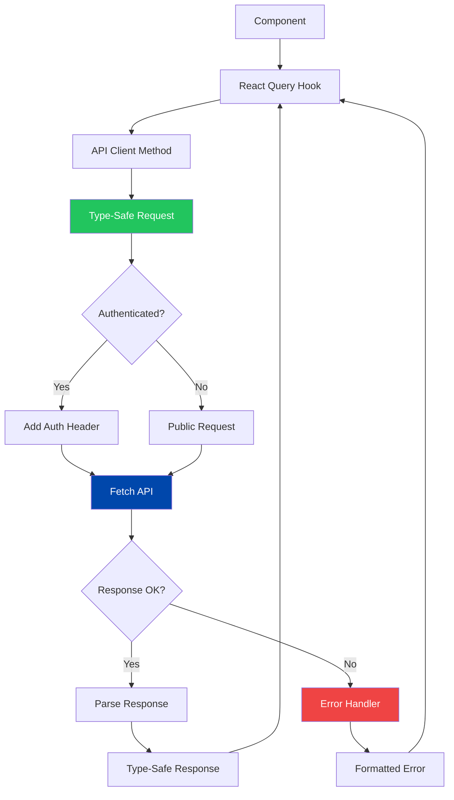
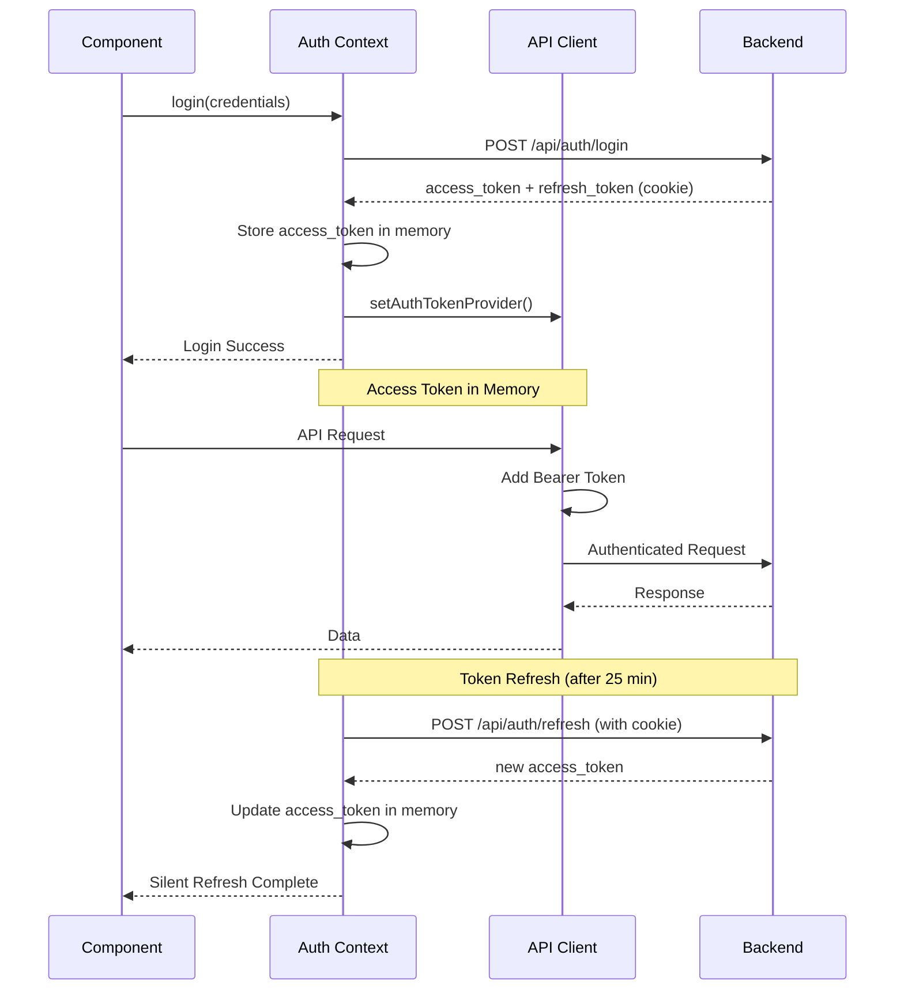
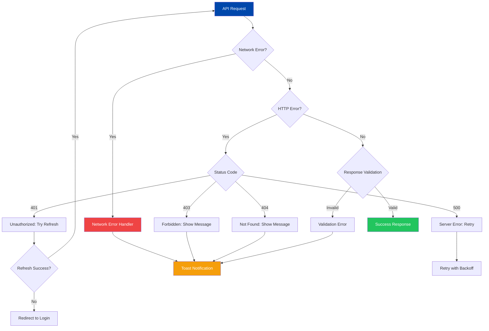

# API Client

## Table of Contents
- [Overview](#overview)
- [Type-Safe API Client](#type-safe-api-client)
- [React Query Integration](#react-query-integration)
- [Authentication Token Handling](#authentication-token-handling)
- [Error Handling Patterns](#error-handling-patterns)
- [Request/Response Types](#requestresponse-types)

## Overview

The API client provides a type-safe interface to the Cobalt Stack backend. It leverages TypeScript types generated from OpenAPI schemas, integrates with React Query for data fetching, and handles authentication tokens automatically.

## Type-Safe API Client

### API Client Flow



### Base API Client

```typescript
// lib/api-client.ts
import { env } from './env'
import type { paths, components } from '@/types/api'

/**
 * API response wrapper type
 */
export type ApiResponse<T> =
  | { success: true; data: T }
  | { success: false; error: string }

/**
 * Base API client class
 */
class ApiClient {
  private baseUrl: string
  private getAuthToken?: () => string | null

  constructor(baseUrl: string = env.apiUrl) {
    this.baseUrl = baseUrl
  }

  /**
   * Set authentication token provider
   */
  setAuthTokenProvider(provider: () => string | null) {
    this.getAuthToken = provider
  }

  /**
   * Make a type-safe request
   */
  private async request<T>(
    path: string,
    options: RequestInit = {}
  ): Promise<ApiResponse<T>> {
    try {
      const headers: HeadersInit = {
        'Content-Type': 'application/json',
        ...options.headers,
      }

      // Add authentication token if available
      const token = this.getAuthToken?.()
      if (token) {
        headers['Authorization'] = `Bearer ${token}`
      }

      const response = await fetch(`${this.baseUrl}${path}`, {
        ...options,
        headers,
        credentials: 'include', // Include cookies for refresh token
      })

      if (!response.ok) {
        const errorData = await response.json().catch(() => ({}))
        return {
          success: false,
          error: errorData.message || `HTTP ${response.status}: ${response.statusText}`,
        }
      }

      const data = await response.json()
      return { success: true, data }
    } catch (error) {
      return {
        success: false,
        error: error instanceof Error ? error.message : 'Unknown error',
      }
    }
  }

  /**
   * GET request
   */
  async get<T>(path: string): Promise<ApiResponse<T>> {
    return this.request<T>(path, { method: 'GET' })
  }

  /**
   * POST request
   */
  async post<T>(path: string, body?: unknown): Promise<ApiResponse<T>> {
    return this.request<T>(path, {
      method: 'POST',
      body: body ? JSON.stringify(body) : undefined,
    })
  }

  /**
   * PUT request
   */
  async put<T>(path: string, body?: unknown): Promise<ApiResponse<T>> {
    return this.request<T>(path, {
      method: 'PUT',
      body: body ? JSON.stringify(body) : undefined,
    })
  }

  /**
   * DELETE request
   */
  async delete<T>(path: string): Promise<ApiResponse<T>> {
    return this.request<T>(path, { method: 'DELETE' })
  }

  // Typed API methods

  /**
   * Health check endpoint
   */
  healthCheck = async () => {
    type HealthResponse = components['schemas']['HealthResponse']
    return this.get<HealthResponse>('/health')
  }

  /**
   * Login endpoint
   */
  login = async (credentials: { username: string; password: string }) => {
    type LoginResponse = components['schemas']['LoginResponse']
    return this.post<LoginResponse>('/api/auth/login', credentials)
  }

  /**
   * Get current user
   */
  getCurrentUser = async () => {
    type UserResponse = components['schemas']['UserResponse']
    return this.get<UserResponse>('/api/auth/me')
  }

  /**
   * Get all users (admin only)
   */
  getUsers = async () => {
    type UsersResponse = components['schemas']['User'][]
    return this.get<UsersResponse>('/api/users')
  }

  /**
   * Get user by ID
   */
  getUser = async (userId: string) => {
    type UserResponse = components['schemas']['User']
    return this.get<UserResponse>(`/api/users/${userId}`)
  }

  /**
   * Update user
   */
  updateUser = async (userId: string, data: Partial<components['schemas']['UpdateUserRequest']>) => {
    type UserResponse = components['schemas']['User']
    return this.put<UserResponse>(`/api/users/${userId}`, data)
  }

  /**
   * Delete user
   */
  deleteUser = async (userId: string) => {
    return this.delete(`/api/users/${userId}`)
  }
}

/**
 * Singleton API client instance
 */
export const apiClient = new ApiClient()
```

## React Query Integration

### Query Hook Patterns

```typescript
// hooks/use-users.ts
import { useQuery, useMutation, useQueryClient } from '@tanstack/react-query'
import { apiClient } from '@/lib/api-client'
import { toast } from 'sonner'

/**
 * Fetch all users
 */
export function useUsers() {
  return useQuery({
    queryKey: ['users'],
    queryFn: async () => {
      const response = await apiClient.getUsers()
      if (!response.success) {
        throw new Error(response.error)
      }
      return response.data
    },
  })
}

/**
 * Fetch single user
 */
export function useUser(userId: string) {
  return useQuery({
    queryKey: ['user', userId],
    queryFn: async () => {
      const response = await apiClient.getUser(userId)
      if (!response.success) {
        throw new Error(response.error)
      }
      return response.data
    },
    enabled: !!userId,
  })
}

/**
 * Update user mutation
 */
export function useUpdateUser() {
  const queryClient = useQueryClient()

  return useMutation({
    mutationFn: async ({ userId, data }: {
      userId: string
      data: Partial<UpdateUserRequest>
    }) => {
      const response = await apiClient.updateUser(userId, data)
      if (!response.success) {
        throw new Error(response.error)
      }
      return response.data
    },
    onSuccess: (data) => {
      toast.success('User updated successfully')
      queryClient.invalidateQueries({ queryKey: ['users'] })
      queryClient.invalidateQueries({ queryKey: ['user', data.id] })
    },
    onError: (error) => {
      toast.error(`Failed to update user: ${error.message}`)
    },
  })
}

/**
 * Delete user mutation
 */
export function useDeleteUser() {
  const queryClient = useQueryClient()

  return useMutation({
    mutationFn: async (userId: string) => {
      const response = await apiClient.deleteUser(userId)
      if (!response.success) {
        throw new Error(response.error)
      }
    },
    onSuccess: () => {
      toast.success('User deleted successfully')
      queryClient.invalidateQueries({ queryKey: ['users'] })
    },
    onError: (error) => {
      toast.error(`Failed to delete user: ${error.message}`)
    },
  })
}
```

## Authentication Token Handling

### Authentication Flow



### Token Provider Setup

```typescript
// contexts/auth-context.tsx
'use client'

import { createContext, useContext, useState, useEffect } from 'react'
import { apiClient } from '@/lib/api-client'
import { env } from '@/lib/env'

interface User {
  id: string
  username: string
  email: string
  role: 'admin' | 'user'
}

interface AuthContextType {
  user: User | null
  accessToken: string | null
  isAuthenticated: boolean
  login: (token: string, user: User) => void
  logout: () => Promise<void>
  refreshToken: () => Promise<boolean>
}

const AuthContext = createContext<AuthContextType | undefined>(undefined)

export function AuthProvider({ children }: { children: React.ReactNode }) {
  const [user, setUser] = useState<User | null>(null)
  const [accessToken, setAccessToken] = useState<string | null>(null)

  // Configure API client with token provider
  useEffect(() => {
    apiClient.setAuthTokenProvider(() => accessToken)
  }, [accessToken])

  const login = (token: string, userData: User) => {
    setAccessToken(token)
    setUser(userData)
  }

  const logout = async () => {
    try {
      await fetch(`${env.apiUrl}/api/auth/logout`, {
        method: 'POST',
        credentials: 'include',
      })
    } catch (error) {
      console.error('Logout error:', error)
    } finally {
      setAccessToken(null)
      setUser(null)
    }
  }

  const refreshToken = async (): Promise<boolean> => {
    try {
      const response = await fetch(`${env.apiUrl}/api/auth/refresh`, {
        method: 'POST',
        credentials: 'include',
      })

      if (!response.ok) {
        return false
      }

      const data = await response.json()
      setAccessToken(data.access_token)

      // Fetch updated user info
      const userResponse = await apiClient.getCurrentUser()
      if (userResponse.success) {
        setUser(userResponse.data)
      }

      return true
    } catch (error) {
      console.error('Token refresh error:', error)
      return false
    }
  }

  // Auto-refresh token before expiry (25 minutes)
  useEffect(() => {
    if (!accessToken) return

    const refreshInterval = 25 * 60 * 1000 // 25 minutes
    const timer = setInterval(refreshToken, refreshInterval)

    return () => clearInterval(timer)
  }, [accessToken])

  return (
    <AuthContext.Provider
      value={{
        user,
        accessToken,
        isAuthenticated: !!user,
        login,
        logout,
        refreshToken,
      }}
    >
      {children}
    </AuthContext.Provider>
  )
}

export function useAuth() {
  const context = useContext(AuthContext)
  if (!context) {
    throw new Error('useAuth must be used within AuthProvider')
  }
  return context
}
```

## Error Handling Patterns

### Error Flow Diagram



### Error Handler Implementation

```typescript
// lib/api-error-handler.ts
export class ApiError extends Error {
  constructor(
    message: string,
    public status?: number,
    public code?: string
  ) {
    super(message)
    this.name = 'ApiError'
  }
}

export function handleApiError(error: unknown): string {
  if (error instanceof ApiError) {
    switch (error.status) {
      case 401:
        return 'Session expired. Please login again.'
      case 403:
        return 'You do not have permission to perform this action.'
      case 404:
        return 'Resource not found.'
      case 500:
        return 'Server error. Please try again later.'
      default:
        return error.message
    }
  }

  if (error instanceof Error) {
    return error.message
  }

  return 'An unexpected error occurred'
}

// Usage in React Query
export function useUsers() {
  return useQuery({
    queryKey: ['users'],
    queryFn: async () => {
      const response = await apiClient.getUsers()
      if (!response.success) {
        throw new ApiError(response.error, response.status)
      }
      return response.data
    },
    retry: (failureCount, error) => {
      // Don't retry on client errors
      if (error instanceof ApiError && error.status && error.status < 500) {
        return false
      }
      return failureCount < 3
    },
  })
}
```

### Retry Logic with Exponential Backoff

```typescript
export function useApiMutation<TData, TVariables>(
  mutationFn: (variables: TVariables) => Promise<TData>
) {
  return useMutation({
    mutationFn,
    retry: (failureCount, error) => {
      // Don't retry on 4xx errors
      if (error instanceof ApiError && error.status && error.status < 500) {
        return false
      }
      // Retry up to 3 times for 5xx errors
      return failureCount < 3
    },
    retryDelay: (attemptIndex) => {
      // Exponential backoff: 1s, 2s, 4s
      return Math.min(1000 * 2 ** attemptIndex, 30000)
    },
  })
}
```

## Request/Response Types

### Type Generation from OpenAPI

```typescript
// types/api.ts (Generated by openapi-typescript)
export interface paths {
  '/api/auth/login': {
    post: {
      requestBody: {
        content: {
          'application/json': {
            username: string
            password: string
          }
        }
      }
      responses: {
        200: {
          content: {
            'application/json': {
              access_token: string
              token_type: string
              user: components['schemas']['User']
            }
          }
        }
        401: {
          content: {
            'application/json': {
              message: string
            }
          }
        }
      }
    }
  }
  '/api/users': {
    get: {
      responses: {
        200: {
          content: {
            'application/json': components['schemas']['User'][]
          }
        }
      }
    }
    post: {
      requestBody: {
        content: {
          'application/json': components['schemas']['CreateUserRequest']
        }
      }
      responses: {
        201: {
          content: {
            'application/json': components['schemas']['User']
          }
        }
      }
    }
  }
}

export interface components {
  schemas: {
    User: {
      id: string
      username: string
      email: string
      email_verified: boolean
      role: 'admin' | 'user'
      created_at: string
    }
    CreateUserRequest: {
      username: string
      email: string
      password: string
      role?: 'admin' | 'user'
    }
    UpdateUserRequest: {
      email?: string
      password?: string
      role?: 'admin' | 'user'
    }
    HealthResponse: {
      status: string
      timestamp: string
    }
  }
}
```

### Type Extraction Helpers

```typescript
// lib/api-types.ts
import type { paths, components } from '@/types/api'

/**
 * Extract request body type from path
 */
export type RequestBody<
  Path extends keyof paths,
  Method extends keyof paths[Path]
> = paths[Path][Method] extends { requestBody: { content: { 'application/json': infer T } } }
  ? T
  : never

/**
 * Extract response type from path
 */
export type ResponseBody<
  Path extends keyof paths,
  Method extends keyof paths[Path],
  Status extends number = 200
> = paths[Path][Method] extends {
  responses: { [K in Status]: { content: { 'application/json': infer T } } }
}
  ? T
  : never

// Usage examples
type LoginRequest = RequestBody<'/api/auth/login', 'post'>
type LoginResponse = ResponseBody<'/api/auth/login', 'post', 200>
type UsersResponse = ResponseBody<'/api/users', 'get', 200>
```

## Best Practices

### API Client Design
- Use singleton pattern for API client instance
- Configure auth token provider at app initialization
- Type all requests and responses with generated types
- Handle credentials (cookies) consistently

### Request Handling
- Always include `Content-Type` headers
- Add authentication tokens to protected routes
- Use `credentials: 'include'` for cookie-based auth
- Implement request/response interceptors for common logic

### Error Handling
- Distinguish between network, HTTP, and validation errors
- Implement retry logic for transient failures
- Use exponential backoff for retries
- Provide user-friendly error messages

### Type Safety
- Regenerate types when OpenAPI schema changes
- Use type helpers to extract nested types
- Leverage TypeScript strict mode
- Avoid `any` types in API code

## Related Documentation
- [Architecture](./architecture.md)
- [State Management](./state-management.md)
- [Authentication Guide](../backend/authentication.md)
- [Testing](./testing.md)
