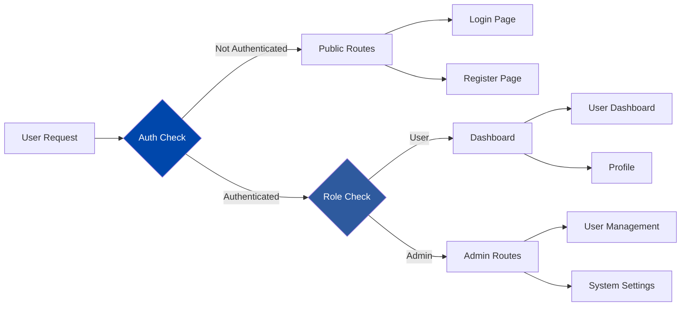
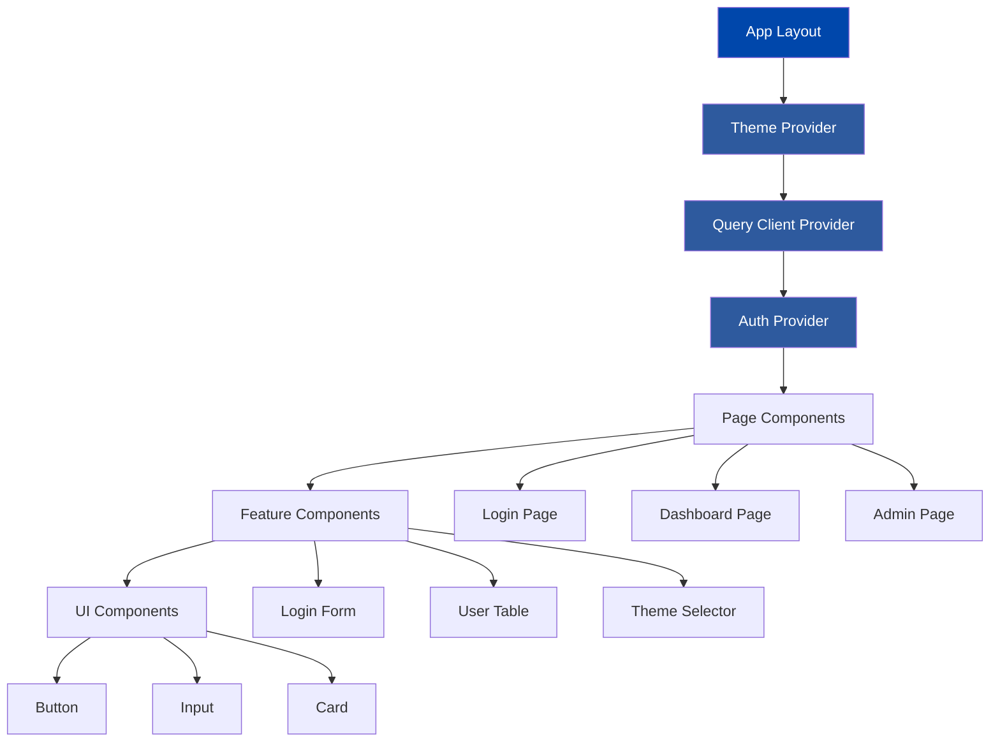
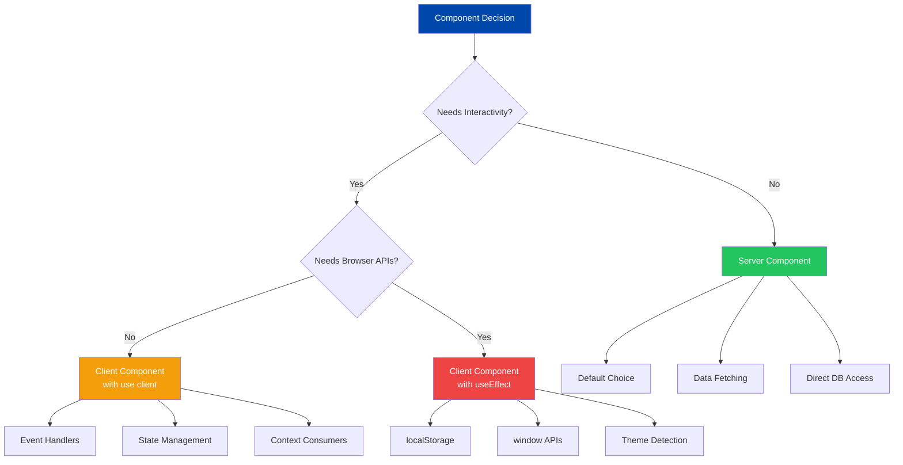
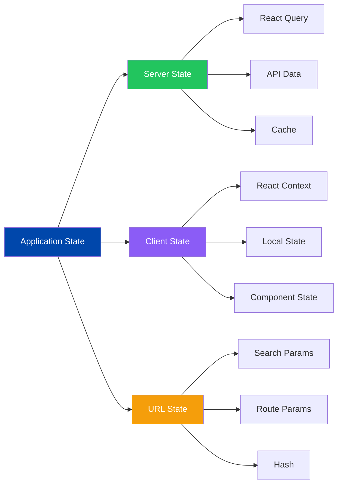
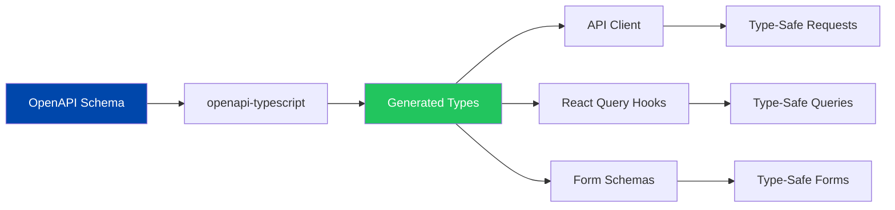
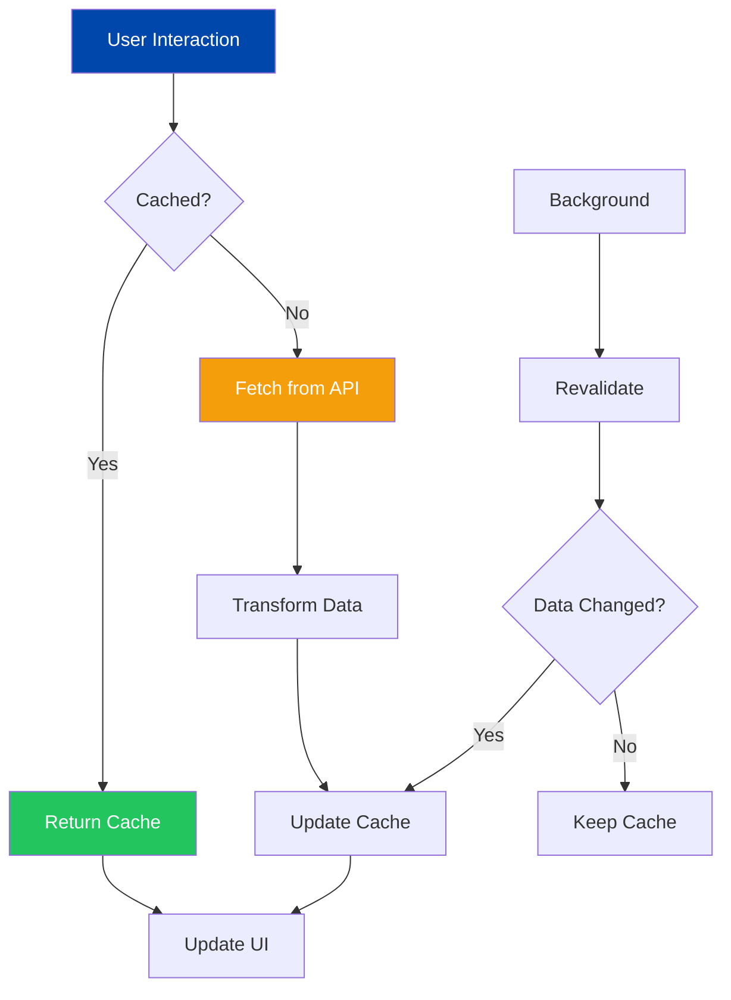

# Frontend Architecture

## Table of Contents
- [Overview](#overview)
- [Technology Stack](#technology-stack)
- [Next.js App Router Patterns](#nextjs-app-router-patterns)
- [Directory Structure](#directory-structure)
- [Component Organization](#component-organization)
- [State Management Strategy](#state-management-strategy)
- [Type Safety](#type-safety)
- [Performance Optimization](#performance-optimization)

## Overview

Cobalt Stack frontend is built with Next.js 15 using the App Router architecture, React 19, TypeScript, and Tailwind CSS. The application follows modern React patterns with server and client components, React Query for data fetching, and a comprehensive theming system.

## Technology Stack

| Technology | Version | Purpose |
|------------|---------|---------|
| Next.js | 15.x | React framework with App Router |
| React | 19.x | UI library with server components |
| TypeScript | 5.x | Type safety and developer experience |
| Tailwind CSS | 3.x | Utility-first styling |
| React Query | 5.x | Server state management |
| shadcn/ui | Latest | Component library |
| Zod | 3.x | Runtime validation |
| React Hook Form | 7.x | Form management |

## Next.js App Router Patterns

### Application Structure

```mermaid
graph TB
    A[Root Layout] --> B[Theme Provider]
    B --> C[Query Client Provider]
    C --> D[Auth Provider]
    D --> E[Page Routes]

    E --> F[Public Routes]
    E --> G[Authenticated Routes]
    E --> H[Admin Routes]

    F --> F1[/login]
    F --> F2[/register]
    F --> F3[/health]

    G --> G1[/dashboard]
    G --> G2[/verify-email]

    H --> H1[/admin/users]

    style A fill:#0047AB,color:#fff
    style B fill:#2E5A9E,color:#fff
    style C fill:#2E5A9E,color:#fff
    style D fill:#2E5A9E,color:#fff
```

### Root Layout

The root layout establishes the application foundation:

```typescript
// src/app/layout.tsx
export default function RootLayout({
  children,
}: {
  children: React.ReactNode;
}) {
  return (
    <html lang="en" suppressHydrationWarning>
      <body className={`${geistSans.variable} ${geistMono.variable}`}>
        <ThemeProvider>
          <Providers>{children}</Providers>
        </ThemeProvider>
      </body>
    </html>
  );
}
```

### Route Groups

Route groups organize related pages without affecting URLs:

```
app/
├── (auth)/              # Authentication routes
│   ├── login/
│   └── register/
├── admin/               # Admin-only routes
│   └── users/
└── dashboard/           # User dashboard
```

### Page Routing Flow



## Directory Structure

### Source Code Organization

```
frontend/src/
├── app/                    # Next.js App Router pages
│   ├── (auth)/            # Auth route group
│   │   ├── login/
│   │   └── register/
│   ├── admin/             # Admin routes
│   ├── dashboard/         # User dashboard
│   ├── layout.tsx         # Root layout
│   ├── page.tsx           # Home page
│   └── providers.tsx      # Client providers
│
├── components/            # React components
│   ├── admin/            # Admin-specific components
│   ├── auth/             # Authentication components
│   ├── theme/            # Theme components
│   └── ui/               # shadcn/ui components
│
├── contexts/              # React contexts
│   ├── auth-context.tsx  # Authentication state
│   └── theme-context.tsx # Theme state
│
├── hooks/                 # Custom React hooks
│   └── use-*.ts          # Hook files
│
├── lib/                   # Utility libraries
│   ├── api-client.ts     # API client
│   ├── theme-config.ts   # Theme configuration
│   └── utils.ts          # Utility functions
│
├── styles/                # Global styles
│   ├── base.css          # Base styles
│   └── themes/           # Theme CSS files
│
└── types/                 # TypeScript types
    └── api.ts            # Generated API types
```

### Component Hierarchy



## Component Organization

### Component Categories

1. **Page Components** (`app/*/page.tsx`)
   - Top-level route components
   - Handle data fetching
   - Compose feature components

2. **Feature Components** (`components/*/`)
   - Domain-specific functionality
   - Business logic integration
   - Composed of UI components

3. **UI Components** (`components/ui/`)
   - Reusable primitives from shadcn/ui
   - No business logic
   - Highly composable

4. **Layout Components** (`app/*/layout.tsx`)
   - Shared layouts for route groups
   - Provider nesting
   - Persistent UI elements

### Server vs Client Components



**Server Component Example:**
```typescript
// app/dashboard/page.tsx (Server Component)
import { DashboardStats } from '@/components/dashboard/stats'

export default async function DashboardPage() {
  // Can fetch data directly on server
  const stats = await fetchStats()

  return (
    <div>
      <h1>Dashboard</h1>
      <DashboardStats data={stats} />
    </div>
  )
}
```

**Client Component Example:**
```typescript
// components/theme/theme-toggle.tsx (Client Component)
'use client'

import { useTheme } from '@/contexts/theme-context'

export function ThemeToggle() {
  const { mode, toggleMode } = useTheme()

  return (
    <button onClick={toggleMode}>
      {mode === 'light' ? 'Dark' : 'Light'}
    </button>
  )
}
```

## State Management Strategy

### State Categories



### State Management Rules

1. **Server State** → React Query
   - API responses
   - User data
   - Backend resources

2. **Client State** → React Context
   - Theme preferences
   - Authentication status
   - UI preferences

3. **Component State** → useState/useReducer
   - Form inputs
   - UI toggles
   - Local interactions

4. **URL State** → Next.js Router
   - Pagination
   - Filters
   - Search queries

## Type Safety

### Type Generation Flow



### Generated API Types

```typescript
// src/types/api.ts (Generated)
export interface paths {
  '/api/auth/login': {
    post: {
      requestBody: {
        content: {
          'application/json': {
            username: string
            password: string
          }
        }
      }
      responses: {
        200: {
          content: {
            'application/json': {
              access_token: string
              token_type: string
            }
          }
        }
      }
    }
  }
}
```

### Type-Safe API Client

```typescript
// src/lib/api-client.ts
import type { paths } from '@/types/api'

type LoginRequest = paths['/api/auth/login']['post']['requestBody']['content']['application/json']
type LoginResponse = paths['/api/auth/login']['post']['responses']['200']['content']['application/json']

class ApiClient {
  async login(data: LoginRequest): Promise<LoginResponse> {
    // Type-safe implementation
  }
}
```

## Performance Optimization

### Data Flow Architecture



### Optimization Strategies

1. **Code Splitting**
   - Automatic route-based splitting
   - Dynamic imports for heavy components
   - Lazy loading with React.lazy

2. **Image Optimization**
   - Next.js Image component
   - Automatic WebP conversion
   - Responsive image loading

3. **Data Fetching**
   - React Query caching
   - Optimistic updates
   - Background revalidation

4. **Bundle Optimization**
   - Tree shaking
   - Import analysis
   - Minimal client JavaScript

### Performance Patterns

```typescript
// Dynamic import for code splitting
const HeavyComponent = dynamic(() => import('./heavy-component'), {
  loading: () => <LoadingSpinner />,
  ssr: false, // Disable SSR if component uses browser APIs
})

// React Query with stale-while-revalidate
const { data } = useQuery({
  queryKey: ['users'],
  queryFn: fetchUsers,
  staleTime: 60 * 1000, // Consider fresh for 1 minute
  gcTime: 5 * 60 * 1000, // Keep in cache for 5 minutes
})

// Optimistic updates
const mutation = useMutation({
  mutationFn: updateUser,
  onMutate: async (newUser) => {
    // Optimistically update cache before request completes
    await queryClient.cancelQueries({ queryKey: ['user'] })
    const previous = queryClient.getQueryData(['user'])
    queryClient.setQueryData(['user'], newUser)
    return { previous }
  },
})
```

## Best Practices

### Component Design
- Keep components small and focused
- Use server components by default
- Add `'use client'` only when needed
- Extract reusable logic to hooks

### State Management
- Use React Query for server state
- Use Context for global client state
- Use URL state for shareable state
- Keep local state in components

### Type Safety
- Regenerate types when backend changes
- Use strict TypeScript settings
- Leverage type inference
- Avoid `any` types

### Performance
- Lazy load heavy components
- Use React Query caching
- Optimize images with Next.js Image
- Monitor bundle size

## Related Documentation
- [Component Organization](./components.md)
- [State Management](./state-management.md)
- [API Client](./api-client.md)
- [Theme System](./themes.md)
