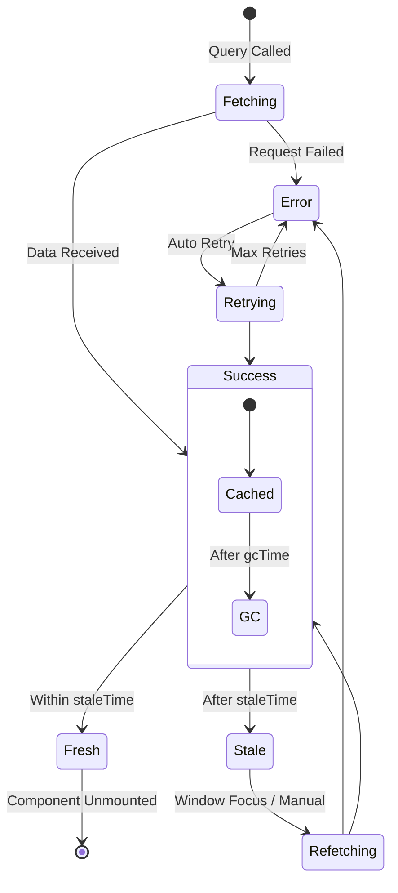
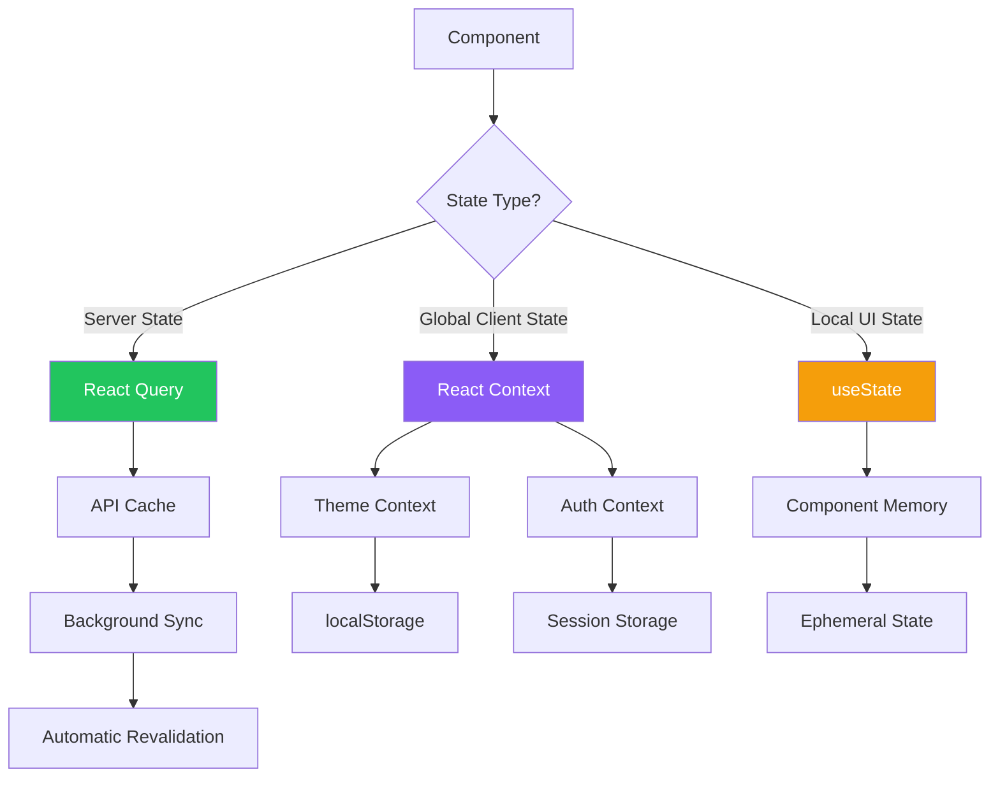
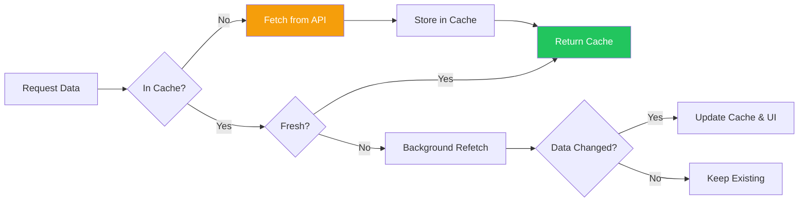
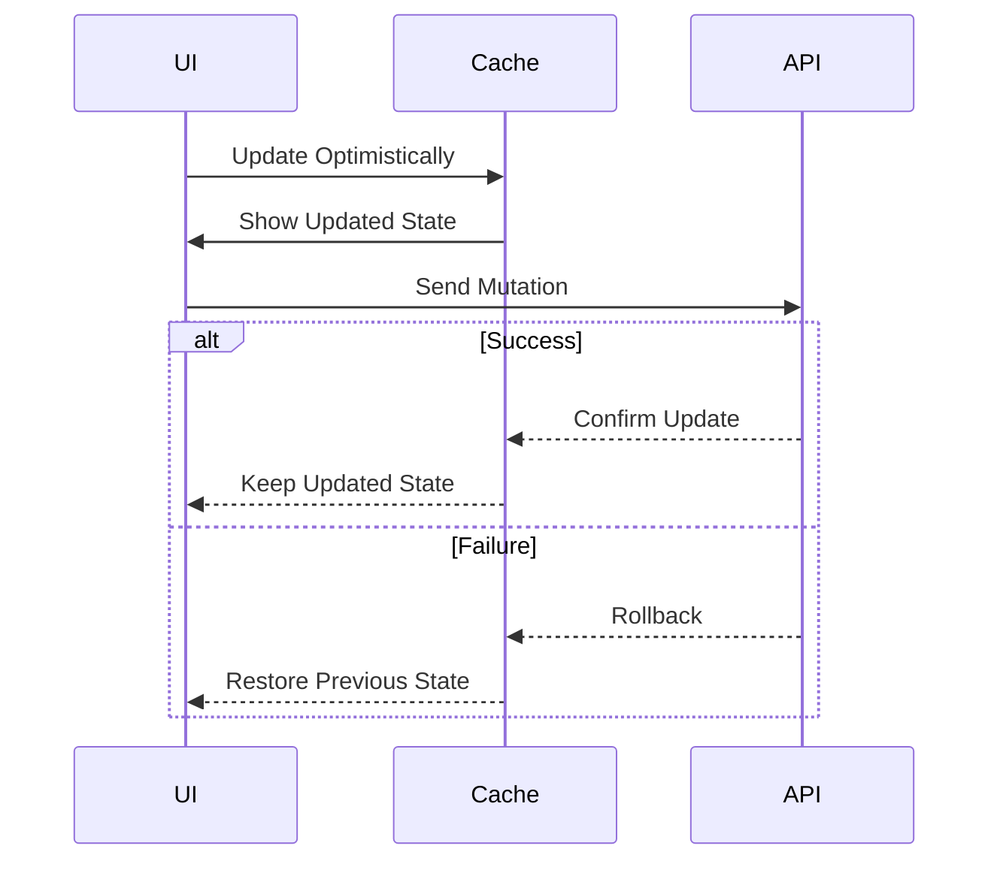
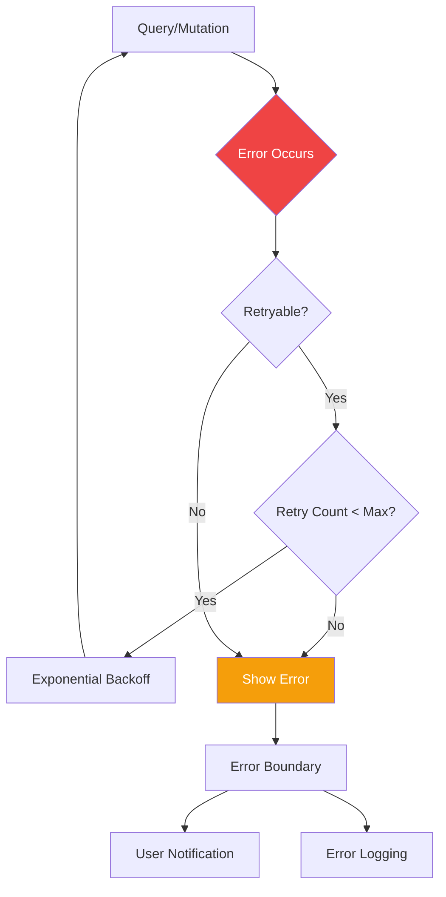

# State Management

## Table of Contents
- [Overview](#overview)
- [React Query Patterns](#react-query-patterns)
- [Client State vs Server State](#client-state-vs-server-state)
- [Cache Management](#cache-management)
- [Optimistic Updates](#optimistic-updates)
- [Error Handling](#error-handling)

## Overview

Cobalt Stack uses a hybrid state management approach:
- **React Query** for server state (API data, caching)
- **React Context** for client state (theme, authentication)
- **Component State** for local UI state

This separation ensures optimal performance, clear data flow, and minimal complexity.

## React Query Patterns

### Query Client Setup

```typescript
// app/providers.tsx
'use client'

import { QueryClient, QueryClientProvider } from '@tanstack/react-query'
import { useState } from 'react'

export function Providers({ children }: { children: React.ReactNode }) {
  const [queryClient] = useState(
    () =>
      new QueryClient({
        defaultOptions: {
          queries: {
            staleTime: 60 * 1000, // Consider fresh for 1 minute
            retry: 1,
            refetchOnWindowFocus: false,
          },
        },
      })
  )

  return (
    <QueryClientProvider client={queryClient}>
      {children}
    </QueryClientProvider>
  )
}
```

### Query Lifecycle



### Basic Query

```typescript
import { useQuery } from '@tanstack/react-query'
import { apiClient } from '@/lib/api-client'

export function useUsers() {
  return useQuery({
    queryKey: ['users'],
    queryFn: async () => {
      const response = await apiClient.getUsers()
      if (!response.success) {
        throw new Error(response.error)
      }
      return response.data
    },
  })
}

// Usage in component
function UserList() {
  const { data, isLoading, error } = useUsers()

  if (isLoading) return <div>Loading...</div>
  if (error) return <div>Error: {error.message}</div>

  return (
    <ul>
      {data?.map((user) => (
        <li key={user.id}>{user.username}</li>
      ))}
    </ul>
  )
}
```

### Query with Parameters

```typescript
export function useUser(userId: string) {
  return useQuery({
    queryKey: ['user', userId],
    queryFn: async () => {
      const response = await apiClient.getUser(userId)
      if (!response.success) {
        throw new Error(response.error)
      }
      return response.data
    },
    enabled: !!userId, // Only run query if userId exists
  })
}
```

### Mutation Patterns

```typescript
import { useMutation, useQueryClient } from '@tanstack/react-query'

export function useUpdateUser() {
  const queryClient = useQueryClient()

  return useMutation({
    mutationFn: async (data: UpdateUserData) => {
      const response = await apiClient.updateUser(data)
      if (!response.success) {
        throw new Error(response.error)
      }
      return response.data
    },
    onSuccess: (data) => {
      // Invalidate and refetch user queries
      queryClient.invalidateQueries({ queryKey: ['users'] })
      queryClient.invalidateQueries({ queryKey: ['user', data.id] })
    },
  })
}

// Usage in component
function UpdateUserForm({ userId }: { userId: string }) {
  const mutation = useUpdateUser()

  const handleSubmit = async (formData: UpdateUserData) => {
    try {
      await mutation.mutateAsync(formData)
      toast.success('User updated successfully')
    } catch (error) {
      toast.error('Failed to update user')
    }
  }

  return (
    <form onSubmit={handleSubmit}>
      {/* Form fields */}
      <button type="submit" disabled={mutation.isPending}>
        {mutation.isPending ? 'Updating...' : 'Update'}
      </button>
    </form>
  )
}
```

## Client State vs Server State

### State Flow Architecture



### Server State (React Query)

**Use for:**
- API responses
- Database records
- Backend resources
- Shared data across components

```typescript
// Server state example
export function useHealthCheck() {
  return useQuery({
    queryKey: ['health'],
    queryFn: async () => {
      const response = await apiClient.healthCheck()
      return response.data
    },
    refetchInterval: 30000, // Refetch every 30s
  })
}
```

### Global Client State (React Context)

**Use for:**
- Authentication status
- Theme preferences
- UI layout state
- User preferences

```typescript
// contexts/auth-context.tsx
'use client'

import { createContext, useContext, useState, useCallback } from 'react'

interface User {
  id: string
  username: string
  email: string
  role: 'admin' | 'user'
}

interface AuthContextType {
  user: User | null
  accessToken: string | null
  isAuthenticated: boolean
  login: (token: string, user: User) => void
  logout: () => void
}

const AuthContext = createContext<AuthContextType | undefined>(undefined)

export function AuthProvider({ children }: { children: React.ReactNode }) {
  const [user, setUser] = useState<User | null>(null)
  const [accessToken, setAccessToken] = useState<string | null>(null)

  const login = useCallback((token: string, userData: User) => {
    setAccessToken(token)
    setUser(userData)
  }, [])

  const logout = useCallback(() => {
    setAccessToken(null)
    setUser(null)
  }, [])

  return (
    <AuthContext.Provider
      value={{
        user,
        accessToken,
        isAuthenticated: !!user,
        login,
        logout,
      }}
    >
      {children}
    </AuthContext.Provider>
  )
}

export function useAuth() {
  const context = useContext(AuthContext)
  if (!context) {
    throw new Error('useAuth must be used within AuthProvider')
  }
  return context
}
```

### Local Component State

**Use for:**
- Form inputs
- UI toggles
- Modal visibility
- Temporary data

```typescript
function SearchInput() {
  const [query, setQuery] = useState('')
  const [isOpen, setIsOpen] = useState(false)

  return (
    <div>
      <input
        value={query}
        onChange={(e) => setQuery(e.target.value)}
        onFocus={() => setIsOpen(true)}
      />
      {isOpen && <SearchResults query={query} />}
    </div>
  )
}
```

## Cache Management

### Cache Strategy Flow



### Cache Configuration

```typescript
const queryClient = new QueryClient({
  defaultOptions: {
    queries: {
      // Time data is considered fresh (no refetch)
      staleTime: 60 * 1000, // 1 minute

      // Time data stays in cache after component unmount
      gcTime: 5 * 60 * 1000, // 5 minutes (formerly cacheTime)

      // Retry failed requests
      retry: 1,

      // Refetch behavior
      refetchOnWindowFocus: false,
      refetchOnReconnect: true,
      refetchOnMount: true,
    },
  },
})
```

### Query Invalidation

```typescript
import { useQueryClient } from '@tanstack/react-query'

function UserActions({ userId }: { userId: string }) {
  const queryClient = useQueryClient()

  const handleUpdate = async () => {
    await updateUser(userId)

    // Invalidate specific user query
    queryClient.invalidateQueries({ queryKey: ['user', userId] })

    // Invalidate all user queries
    queryClient.invalidateQueries({ queryKey: ['users'] })

    // Invalidate with predicate
    queryClient.invalidateQueries({
      predicate: (query) => query.queryKey[0] === 'user',
    })
  }

  return <button onClick={handleUpdate}>Update User</button>
}
```

### Manual Cache Updates

```typescript
function useDeleteUser() {
  const queryClient = useQueryClient()

  return useMutation({
    mutationFn: deleteUser,
    onSuccess: (_, userId) => {
      // Manually update cache
      queryClient.setQueryData(['users'], (old: User[] | undefined) => {
        return old?.filter((user) => user.id !== userId)
      })
    },
  })
}
```

## Optimistic Updates

### Optimistic Update Flow



### Implementation Pattern

```typescript
function useUpdateUserMutation() {
  const queryClient = useQueryClient()

  return useMutation({
    mutationFn: updateUser,

    // Before mutation starts
    onMutate: async (newUser) => {
      // Cancel outgoing refetches
      await queryClient.cancelQueries({ queryKey: ['users'] })

      // Snapshot current value
      const previousUsers = queryClient.getQueryData<User[]>(['users'])

      // Optimistically update cache
      queryClient.setQueryData<User[]>(['users'], (old) => {
        if (!old) return [newUser]
        return old.map((user) => (user.id === newUser.id ? newUser : user))
      })

      // Return context for rollback
      return { previousUsers }
    },

    // On error, rollback
    onError: (err, newUser, context) => {
      queryClient.setQueryData(['users'], context?.previousUsers)
      toast.error('Failed to update user')
    },

    // Always refetch after success or error
    onSettled: () => {
      queryClient.invalidateQueries({ queryKey: ['users'] })
    },
  })
}

// Usage
function UserRow({ user }: { user: User }) {
  const updateMutation = useUpdateUserMutation()

  const handleToggleStatus = () => {
    updateMutation.mutate({
      ...user,
      status: user.status === 'active' ? 'inactive' : 'active',
    })
  }

  return (
    <div>
      <span>{user.username}</span>
      <button onClick={handleToggleStatus}>
        {user.status}
      </button>
    </div>
  )
}
```

## Error Handling

### Error Handling Strategy



### Query Error Handling

```typescript
export function useUsers() {
  return useQuery({
    queryKey: ['users'],
    queryFn: fetchUsers,
    retry: (failureCount, error) => {
      // Don't retry on 404 or 401
      if (error.status === 404 || error.status === 401) {
        return false
      }
      // Retry up to 3 times for other errors
      return failureCount < 3
    },
    retryDelay: (attemptIndex) => {
      // Exponential backoff: 1s, 2s, 4s
      return Math.min(1000 * 2 ** attemptIndex, 30000)
    },
  })
}

// Component with error handling
function UserList() {
  const { data, error, isError, refetch } = useUsers()

  if (isError) {
    return (
      <div className="error-container">
        <p>Error loading users: {error.message}</p>
        <button onClick={() => refetch()}>Retry</button>
      </div>
    )
  }

  // ... render data
}
```

### Mutation Error Handling

```typescript
export function useCreateUser() {
  const queryClient = useQueryClient()

  return useMutation({
    mutationFn: createUser,
    onError: (error, variables, context) => {
      // Log error
      console.error('Failed to create user:', error)

      // Show user-friendly message
      if (error.message.includes('username')) {
        toast.error('Username already taken')
      } else if (error.message.includes('email')) {
        toast.error('Email already registered')
      } else {
        toast.error('Failed to create user. Please try again.')
      }
    },
    onSuccess: () => {
      toast.success('User created successfully')
      queryClient.invalidateQueries({ queryKey: ['users'] })
    },
  })
}

// Component with mutation error handling
function CreateUserForm() {
  const createUser = useCreateUser()

  const handleSubmit = async (data: CreateUserData) => {
    try {
      await createUser.mutateAsync(data)
    } catch (error) {
      // Error already handled in mutation
      // Optionally handle component-specific logic
    }
  }

  return (
    <form onSubmit={handleSubmit}>
      {/* Form fields */}
      {createUser.isError && (
        <div className="text-destructive">
          {createUser.error.message}
        </div>
      )}
      <button type="submit" disabled={createUser.isPending}>
        Create User
      </button>
    </form>
  )
}
```

### Global Error Boundary

```typescript
'use client'

import { Component, ReactNode } from 'react'

interface Props {
  children: ReactNode
}

interface State {
  hasError: boolean
  error?: Error
}

export class ErrorBoundary extends Component<Props, State> {
  constructor(props: Props) {
    super(props)
    this.state = { hasError: false }
  }

  static getDerivedStateFromError(error: Error): State {
    return { hasError: true, error }
  }

  componentDidCatch(error: Error, errorInfo: React.ErrorInfo) {
    console.error('Error caught by boundary:', error, errorInfo)
    // Send to error tracking service
  }

  render() {
    if (this.state.hasError) {
      return (
        <div className="error-page">
          <h1>Something went wrong</h1>
          <p>{this.state.error?.message}</p>
          <button onClick={() => this.setState({ hasError: false })}>
            Try again
          </button>
        </div>
      )
    }

    return this.props.children
  }
}
```

## Best Practices

### Query Keys
- Use arrays for hierarchical keys: `['users', userId]`
- Include all variables: `['posts', { page, filter }]`
- Keep keys consistent across app

### Cache Strategy
- Set appropriate `staleTime` based on data volatility
- Use `gcTime` to control memory usage
- Prefetch predictable user actions

### Mutations
- Always invalidate related queries
- Use optimistic updates for better UX
- Handle errors gracefully with user feedback

### Performance
- Avoid unnecessary refetches
- Use pagination for large datasets
- Leverage background refetching
- Monitor cache size

## Related Documentation
- [Architecture](./architecture.md)
- [API Client](./api-client.md)
- [Components](./components.md)
- [Testing](./testing.md)
