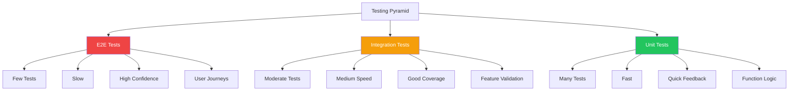
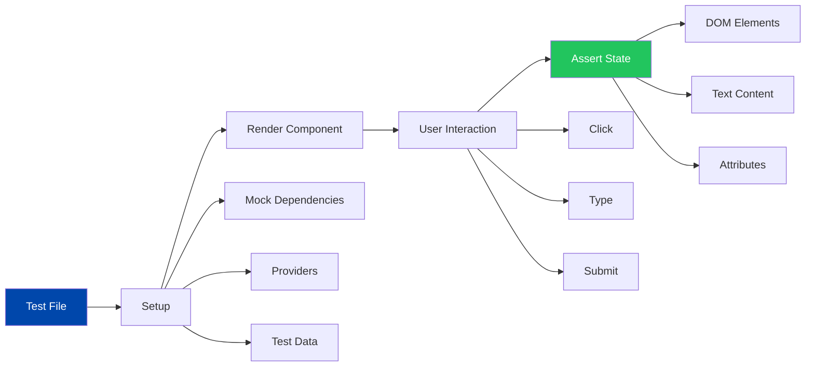
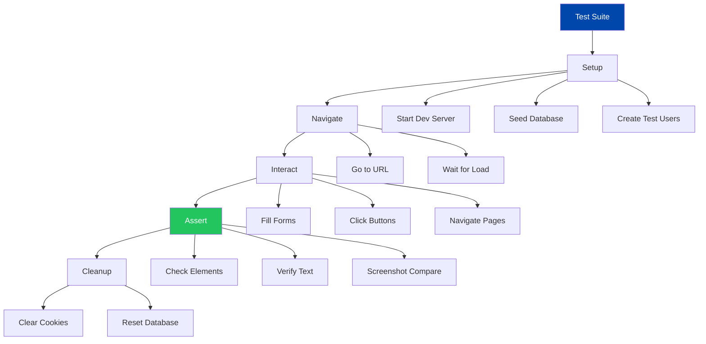
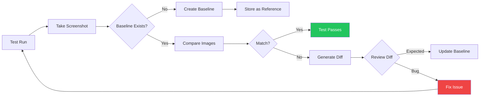

# Frontend Testing

## Table of Contents
- [Overview](#overview)
- [Testing Strategy](#testing-strategy)
- [Component Testing](#component-testing)
- [E2E Testing with Playwright](#e2e-testing-with-playwright)
- [Visual Regression Testing](#visual-regression-testing)
- [Best Practices](#best-practices)

## Overview

Cobalt Stack frontend uses a comprehensive testing strategy combining component tests, end-to-end tests, and visual regression tests to ensure application quality and prevent regressions.

## Testing Strategy

### Testing Pyramid



### Test Distribution

| Test Type | Coverage | Speed | Purpose | Tools |
|-----------|----------|-------|---------|-------|
| Unit Tests | 60% | Fast | Component logic, utilities | Jest, Testing Library |
| Integration Tests | 30% | Medium | Feature workflows, API integration | React Query, MSW |
| E2E Tests | 10% | Slow | Critical user paths | Playwright |
| Visual Tests | On-demand | Medium | UI consistency, design system | Playwright screenshots |

## Component Testing

### Component Test Structure



### Testing Library Setup

```typescript
// lib/test-utils.tsx
import { render, RenderOptions } from '@testing-library/react'
import { QueryClient, QueryClientProvider } from '@tanstack/react-query'
import { ReactElement, ReactNode } from 'react'

// Create test query client
function createTestQueryClient() {
  return new QueryClient({
    defaultOptions: {
      queries: {
        retry: false, // Disable retries in tests
        gcTime: Infinity, // Prevent cache cleanup during tests
      },
    },
  })
}

// Test wrapper with providers
interface WrapperProps {
  children: ReactNode
}

function createWrapper() {
  const testQueryClient = createTestQueryClient()

  return function Wrapper({ children }: WrapperProps) {
    return (
      <QueryClientProvider client={testQueryClient}>
        {children}
      </QueryClientProvider>
    )
  }
}

// Custom render with providers
export function renderWithProviders(
  ui: ReactElement,
  options?: Omit<RenderOptions, 'wrapper'>
) {
  return render(ui, { wrapper: createWrapper(), ...options })
}

// Re-export everything
export * from '@testing-library/react'
export { renderWithProviders as render }
```

### Button Component Test

```typescript
// components/ui/button.test.tsx
import { render, screen } from '@/lib/test-utils'
import { Button } from './button'
import userEvent from '@testing-library/user-event'

describe('Button', () => {
  it('renders with text', () => {
    render(<Button>Click me</Button>)
    expect(screen.getByText('Click me')).toBeInTheDocument()
  })

  it('handles click events', async () => {
    const handleClick = jest.fn()
    const user = userEvent.setup()

    render(<Button onClick={handleClick}>Click me</Button>)

    await user.click(screen.getByText('Click me'))
    expect(handleClick).toHaveBeenCalledTimes(1)
  })

  it('applies variant styles', () => {
    render(<Button variant="destructive">Delete</Button>)
    const button = screen.getByText('Delete')
    expect(button).toHaveClass('bg-destructive')
  })

  it('disables button when disabled prop is true', () => {
    render(<Button disabled>Disabled</Button>)
    expect(screen.getByText('Disabled')).toBeDisabled()
  })

  it('renders as child element with asChild prop', () => {
    render(
      <Button asChild>
        <a href="/link">Link Button</a>
      </Button>
    )
    expect(screen.getByText('Link Button')).toHaveAttribute('href', '/link')
  })
})
```

### Form Component Test

```typescript
// components/auth/login-form.test.tsx
import { render, screen, waitFor } from '@/lib/test-utils'
import { LoginForm } from './login-form'
import userEvent from '@testing-library/user-event'
import { server } from '@/mocks/server'
import { http, HttpResponse } from 'msw'

describe('LoginForm', () => {
  it('renders login form fields', () => {
    render(<LoginForm />)

    expect(screen.getByLabelText(/username/i)).toBeInTheDocument()
    expect(screen.getByLabelText(/password/i)).toBeInTheDocument()
    expect(screen.getByRole('button', { name: /login/i })).toBeInTheDocument()
  })

  it('shows validation errors for empty fields', async () => {
    const user = userEvent.setup()
    render(<LoginForm />)

    const submitButton = screen.getByRole('button', { name: /login/i })
    await user.click(submitButton)

    await waitFor(() => {
      expect(screen.getByText(/username is required/i)).toBeInTheDocument()
      expect(screen.getByText(/password is required/i)).toBeInTheDocument()
    })
  })

  it('submits form with valid credentials', async () => {
    const user = userEvent.setup()
    const mockLogin = jest.fn()

    render(<LoginForm onSuccess={mockLogin} />)

    await user.type(screen.getByLabelText(/username/i), 'testuser')
    await user.type(screen.getByLabelText(/password/i), 'password123')
    await user.click(screen.getByRole('button', { name: /login/i }))

    await waitFor(() => {
      expect(mockLogin).toHaveBeenCalled()
    })
  })

  it('shows error message for invalid credentials', async () => {
    const user = userEvent.setup()

    // Mock failed login response
    server.use(
      http.post('/api/auth/login', () => {
        return HttpResponse.json(
          { message: 'Invalid credentials' },
          { status: 401 }
        )
      })
    )

    render(<LoginForm />)

    await user.type(screen.getByLabelText(/username/i), 'wronguser')
    await user.type(screen.getByLabelText(/password/i), 'wrongpass')
    await user.click(screen.getByRole('button', { name: /login/i }))

    await waitFor(() => {
      expect(screen.getByText(/invalid credentials/i)).toBeInTheDocument()
    })
  })

  it('disables submit button while loading', async () => {
    const user = userEvent.setup()
    render(<LoginForm />)

    await user.type(screen.getByLabelText(/username/i), 'testuser')
    await user.type(screen.getByLabelText(/password/i), 'password123')

    const submitButton = screen.getByRole('button', { name: /login/i })
    await user.click(submitButton)

    expect(submitButton).toBeDisabled()
    expect(screen.getByText(/logging in/i)).toBeInTheDocument()
  })
})
```

### React Query Hook Test

```typescript
// hooks/use-users.test.ts
import { renderHook, waitFor } from '@testing-library/react'
import { useUsers, useUpdateUser } from './use-users'
import { createWrapper } from '@/lib/test-utils'
import { server } from '@/mocks/server'
import { http, HttpResponse } from 'msw'

describe('useUsers', () => {
  it('fetches users successfully', async () => {
    const { result } = renderHook(() => useUsers(), {
      wrapper: createWrapper(),
    })

    expect(result.current.isLoading).toBe(true)

    await waitFor(() => {
      expect(result.current.isSuccess).toBe(true)
    })

    expect(result.current.data).toHaveLength(2)
    expect(result.current.data[0]).toHaveProperty('username')
  })

  it('handles fetch error', async () => {
    server.use(
      http.get('/api/users', () => {
        return HttpResponse.json(
          { message: 'Internal server error' },
          { status: 500 }
        )
      })
    )

    const { result } = renderHook(() => useUsers(), {
      wrapper: createWrapper(),
    })

    await waitFor(() => {
      expect(result.current.isError).toBe(true)
    })

    expect(result.current.error).toBeDefined()
  })
})

describe('useUpdateUser', () => {
  it('updates user successfully', async () => {
    const { result } = renderHook(() => useUpdateUser(), {
      wrapper: createWrapper(),
    })

    const updateData = { email: 'newemail@example.com' }

    result.current.mutate({ userId: '1', data: updateData })

    await waitFor(() => {
      expect(result.current.isSuccess).toBe(true)
    })

    expect(result.current.data).toMatchObject({
      id: '1',
      email: 'newemail@example.com',
    })
  })

  it('handles update error', async () => {
    server.use(
      http.put('/api/users/:id', () => {
        return HttpResponse.json(
          { message: 'Validation error' },
          { status: 400 }
        )
      })
    )

    const { result } = renderHook(() => useUpdateUser(), {
      wrapper: createWrapper(),
    })

    result.current.mutate({ userId: '1', data: { email: 'invalid' } })

    await waitFor(() => {
      expect(result.current.isError).toBe(true)
    })
  })
})
```

## E2E Testing with Playwright

### E2E Test Architecture



### Playwright Configuration

```typescript
// playwright.config.ts
import { defineConfig, devices } from '@playwright/test'

export default defineConfig({
  testDir: './e2e',
  fullyParallel: true,
  forbidOnly: !!process.env.CI,
  retries: process.env.CI ? 2 : 0,
  workers: process.env.CI ? 1 : undefined,

  reporter: [
    ['html'],
    ['list'],
  ],

  use: {
    baseURL: 'http://localhost:3000',
    trace: 'on-first-retry',
    screenshot: 'only-on-failure',
  },

  projects: [
    {
      name: 'chromium',
      use: { ...devices['Desktop Chrome'] },
    },
    {
      name: 'firefox',
      use: { ...devices['Desktop Firefox'] },
    },
    {
      name: 'webkit',
      use: { ...devices['Desktop Safari'] },
    },
    {
      name: 'mobile-chrome',
      use: { ...devices['Pixel 5'] },
    },
  ],

  webServer: {
    command: 'npm run dev',
    url: 'http://localhost:3000',
    reuseExistingServer: !process.env.CI,
  },
})
```

### Authentication E2E Test

```typescript
// e2e/auth.spec.ts
import { test, expect } from '@playwright/test'

test.describe('Authentication Flow', () => {
  test('successful login redirects to dashboard', async ({ page }) => {
    await page.goto('/login')

    // Fill login form
    await page.getByLabel('Username').fill('testuser')
    await page.getByLabel('Password').fill('password123')

    // Submit form
    await page.getByRole('button', { name: 'Login' }).click()

    // Should redirect to dashboard
    await expect(page).toHaveURL('/dashboard')

    // Should show user info
    await expect(page.getByText('Welcome, testuser')).toBeVisible()
  })

  test('invalid credentials show error message', async ({ page }) => {
    await page.goto('/login')

    await page.getByLabel('Username').fill('wronguser')
    await page.getByLabel('Password').fill('wrongpass')
    await page.getByRole('button', { name: 'Login' }).click()

    // Should stay on login page
    await expect(page).toHaveURL('/login')

    // Should show error
    await expect(page.getByText(/invalid credentials/i)).toBeVisible()
  })

  test('logout clears session and redirects', async ({ page }) => {
    // Login first
    await page.goto('/login')
    await page.getByLabel('Username').fill('testuser')
    await page.getByLabel('Password').fill('password123')
    await page.getByRole('button', { name: 'Login' }).click()
    await expect(page).toHaveURL('/dashboard')

    // Logout
    await page.getByRole('button', { name: 'Logout' }).click()

    // Should redirect to login
    await expect(page).toHaveURL('/login')

    // Trying to access dashboard should redirect back
    await page.goto('/dashboard')
    await expect(page).toHaveURL('/login')
  })

  test('registration creates new account', async ({ page }) => {
    await page.goto('/register')

    await page.getByLabel('Username').fill('newuser')
    await page.getByLabel('Email').fill('newuser@example.com')
    await page.getByLabel('Password').fill('securepass123')
    await page.getByRole('button', { name: 'Register' }).click()

    // Should show success message
    await expect(page.getByText(/registration successful/i)).toBeVisible()

    // Should redirect to login
    await expect(page).toHaveURL('/login')
  })
})
```

### User Management E2E Test

```typescript
// e2e/admin/users.spec.ts
import { test, expect } from '@playwright/test'

test.describe('Admin User Management', () => {
  test.beforeEach(async ({ page }) => {
    // Login as admin
    await page.goto('/login')
    await page.getByLabel('Username').fill('admin')
    await page.getByLabel('Password').fill('adminpass')
    await page.getByRole('button', { name: 'Login' }).click()
    await expect(page).toHaveURL('/dashboard')

    // Navigate to user management
    await page.goto('/admin/users')
  })

  test('displays user table', async ({ page }) => {
    await expect(page.getByRole('heading', { name: 'Users' })).toBeVisible()
    await expect(page.getByRole('table')).toBeVisible()

    // Should have table headers
    await expect(page.getByText('Username')).toBeVisible()
    await expect(page.getByText('Email')).toBeVisible()
    await expect(page.getByText('Role')).toBeVisible()
  })

  test('creates new user', async ({ page }) => {
    await page.getByRole('button', { name: 'Add User' }).click()

    // Fill user form
    await page.getByLabel('Username').fill('testuser2')
    await page.getByLabel('Email').fill('testuser2@example.com')
    await page.getByLabel('Password').fill('password123')
    await page.getByLabel('Role').selectOption('user')

    await page.getByRole('button', { name: 'Create' }).click()

    // Should show success message
    await expect(page.getByText(/user created successfully/i)).toBeVisible()

    // Should appear in table
    await expect(page.getByText('testuser2')).toBeVisible()
  })

  test('updates existing user', async ({ page }) => {
    // Click edit button for first user
    await page.getByRole('row').first().getByRole('button', { name: 'Edit' }).click()

    // Change email
    await page.getByLabel('Email').clear()
    await page.getByLabel('Email').fill('updated@example.com')

    await page.getByRole('button', { name: 'Save' }).click()

    // Should show success message
    await expect(page.getByText(/user updated successfully/i)).toBeVisible()

    // Should show updated email
    await expect(page.getByText('updated@example.com')).toBeVisible()
  })

  test('deletes user with confirmation', async ({ page }) => {
    const userRow = page.getByRole('row').filter({ hasText: 'testuser2' })

    await userRow.getByRole('button', { name: 'Delete' }).click()

    // Confirm deletion
    await page.getByRole('button', { name: 'Confirm' }).click()

    // Should show success message
    await expect(page.getByText(/user deleted successfully/i)).toBeVisible()

    // Should not appear in table
    await expect(page.getByText('testuser2')).not.toBeVisible()
  })
})
```

## Visual Regression Testing

### Visual Testing Strategy



### Visual Test Example

```typescript
// e2e/visual/components.spec.ts
import { test, expect } from '@playwright/test'

test.describe('Component Visual Regression', () => {
  test('button variants', async ({ page }) => {
    await page.goto('/components/button')

    // Take screenshot of button variants
    const buttons = page.locator('[data-testid="button-variants"]')
    await expect(buttons).toHaveScreenshot('button-variants.png')
  })

  test('form components', async ({ page }) => {
    await page.goto('/components/form')

    const form = page.locator('[data-testid="sample-form"]')
    await expect(form).toHaveScreenshot('form-components.png')
  })

  test('theme variants', async ({ page }) => {
    const themes = ['default', 'nature', 'violet-bloom']

    for (const theme of themes) {
      await page.goto(`/?theme=${theme}`)
      await page.locator('[data-theme]').waitFor()

      // Light mode
      await expect(page).toHaveScreenshot(`theme-${theme}-light.png`, {
        fullPage: true,
      })

      // Dark mode
      await page.getByRole('button', { name: 'Toggle theme' }).click()
      await expect(page).toHaveScreenshot(`theme-${theme}-dark.png`, {
        fullPage: true,
      })
    }
  })
})
```

## Best Practices

### Testing Philosophy
- Test behavior, not implementation
- Write tests that resemble user interactions
- Keep tests independent and isolated
- Use meaningful test descriptions

### Component Testing
- Render components with required providers
- Test user interactions with userEvent
- Verify accessibility attributes
- Mock external dependencies

### E2E Testing
- Test critical user journeys
- Use data-testid sparingly (prefer accessible queries)
- Clean up test data after runs
- Run in CI/CD pipeline

### Visual Testing
- Update baselines deliberately
- Review diffs carefully before accepting
- Test across browsers and viewports
- Version control baseline images

### Performance
- Run unit tests frequently during development
- Run E2E tests before commits
- Run visual tests on PR creation
- Parallelize test execution in CI

## Related Documentation
- [Architecture](./architecture.md)
- [Components](./components.md)
- [State Management](./state-management.md)
- [CI/CD Guide](../deployment/ci-cd.md)
