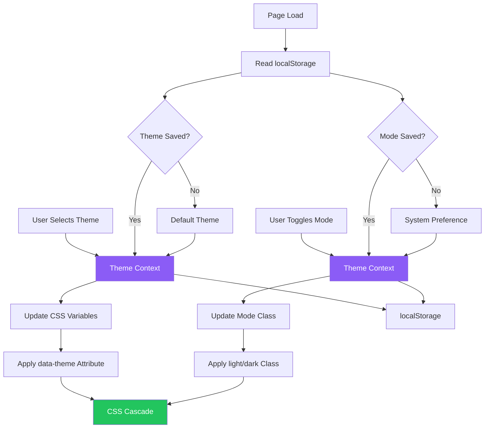
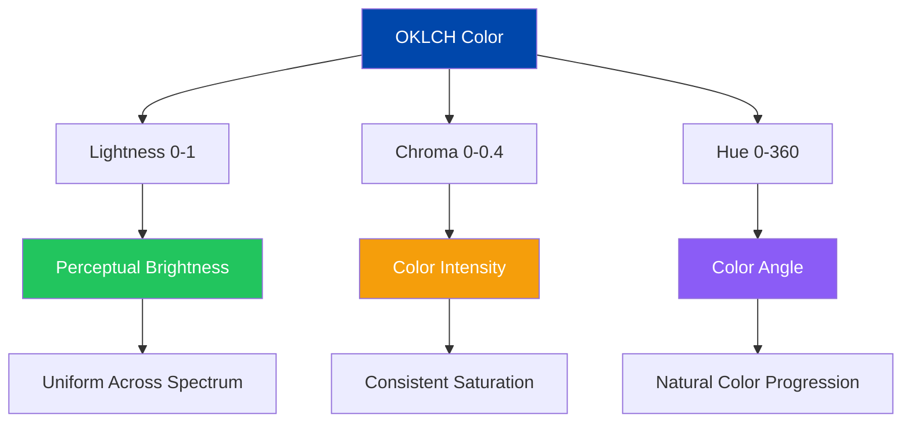
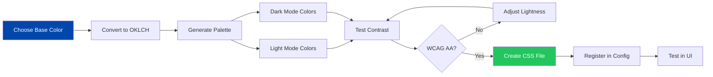
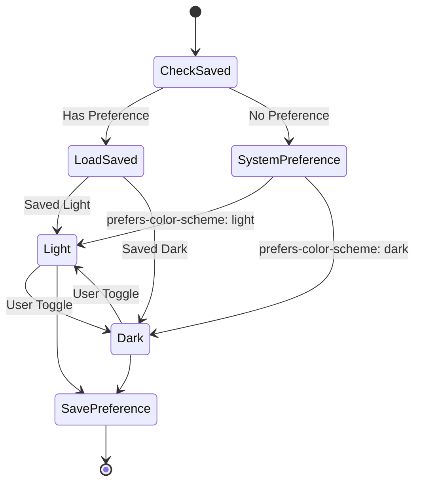

# Theme System

## Table of Contents
- [Overview](#overview)
- [Theme Architecture](#theme-architecture)
- [OKLCH Color Space](#oklch-color-space)
- [Creating Custom Themes](#creating-custom-themes)
- [Dark Mode Implementation](#dark-mode-implementation)
- [Theme Persistence](#theme-persistence)
- [Visual Examples](#visual-examples)

## Overview

Cobalt Stack uses a sophisticated theming system built on OKLCH color space, providing perceptually uniform colors, excellent dark mode support, and easy theme creation. The system supports multiple themes with automatic dark mode variants and persistent user preferences.

## Theme Architecture

### Theme System Flow



### Theme Context Implementation

```typescript
// contexts/theme-context.tsx
'use client'

import { createContext, useContext, useEffect, useState } from 'react'
import type { ThemeName, ThemeMode } from '@/lib/theme-config'

interface ThemeContextType {
  theme: ThemeName
  mode: ThemeMode
  setTheme: (theme: ThemeName) => void
  setMode: (mode: ThemeMode) => void
  toggleMode: () => void
}

const ThemeContext = createContext<ThemeContextType | undefined>(undefined)

export function ThemeProvider({ children }: { children: React.ReactNode }) {
  const [theme, setThemeState] = useState<ThemeName>('default')
  const [mode, setModeState] = useState<ThemeMode>('light')
  const [mounted, setMounted] = useState(false)

  // Load from localStorage on mount
  useEffect(() => {
    setMounted(true)
    const savedTheme = localStorage.getItem('theme') as ThemeName | null
    const savedMode = localStorage.getItem('mode') as ThemeMode | null

    if (savedTheme) setThemeState(savedTheme)
    if (savedMode) setModeState(savedMode)

    // Apply initial classes
    const effectiveMode = savedMode || 'light'
    const effectiveTheme = savedTheme || 'default'

    document.documentElement.classList.remove('light', 'dark')
    document.documentElement.classList.add(effectiveMode)
    document.documentElement.setAttribute('data-theme', effectiveTheme)
  }, [])

  const setTheme = (newTheme: ThemeName) => {
    setThemeState(newTheme)
    localStorage.setItem('theme', newTheme)
    document.documentElement.setAttribute('data-theme', newTheme)
  }

  const setMode = (newMode: ThemeMode) => {
    setModeState(newMode)
    localStorage.setItem('mode', newMode)
    document.documentElement.classList.remove('light', 'dark')
    document.documentElement.classList.add(newMode)
  }

  const toggleMode = () => {
    setMode(mode === 'light' ? 'dark' : 'light')
  }

  // Prevent hydration mismatch
  if (!mounted) return null

  return (
    <ThemeContext.Provider value={{ theme, mode, setTheme, setMode, toggleMode }}>
      {children}
    </ThemeContext.Provider>
  )
}

export function useTheme() {
  const context = useContext(ThemeContext)
  if (!context) {
    throw new Error('useTheme must be used within ThemeProvider')
  }
  return context
}
```

### Theme Configuration

```typescript
// lib/theme-config.ts
export type ThemeMode = 'light' | 'dark'
export type ThemeName = 'default' | 'nature' | 'violet-bloom'

export interface Theme {
  id: ThemeName
  name: string
  description: string
  preview: {
    primary: string
    secondary: string
    accent: string
  }
}

export const themes: Record<ThemeName, Theme> = {
  default: {
    id: 'default',
    name: 'Cobalt',
    description: 'Clean and professional cobalt blue theme',
    preview: {
      primary: '#0047AB',
      secondary: '#6B8EC9',
      accent: '#2E5A9E',
    },
  },
  nature: {
    id: 'nature',
    name: 'Nature',
    description: 'Calming green tones inspired by nature',
    preview: {
      primary: '#22c55e',
      secondary: '#84cc16',
      accent: '#10b981',
    },
  },
  'violet-bloom': {
    id: 'violet-bloom',
    name: 'Violet Bloom',
    description: 'Elegant purple palette with soft edges',
    preview: {
      primary: '#8b5cf6',
      secondary: '#a855f7',
      accent: '#c084fc',
    },
  },
}
```

## OKLCH Color Space

### Color Variable Structure



### Why OKLCH?

**Advantages over RGB/HSL:**
- Perceptually uniform brightness
- Consistent saturation across hues
- Better dark mode color generation
- More predictable color manipulations

**OKLCH Format:**
```css
oklch(lightness chroma hue)
```

### Default Theme Colors

```css
/* styles/themes/default.css */
[data-theme="default"] {
  /* Primary colors - Rich Cobalt Blue (#0047AB) */
  --primary: oklch(0.4600 0.1950 250.0000);
  --primary-foreground: oklch(1.0000 0 0);

  /* Background colors - Crisp white with subtle cobalt tint */
  --background: oklch(0.9900 0.0020 250.0000);
  --foreground: oklch(0.1500 0.0100 250.0000);

  /* Card colors - Elevated surfaces */
  --card: oklch(0.9950 0.0015 250.0000);
  --card-foreground: oklch(0.1500 0.0100 250.0000);

  /* Secondary colors - Soft cobalt with contrast */
  --secondary: oklch(0.9300 0.0150 250.0000);
  --secondary-foreground: oklch(0.2000 0.0200 250.0000);

  /* Muted colors - Subtle backgrounds */
  --muted: oklch(0.9500 0.0080 250.0000);
  --muted-foreground: oklch(0.4800 0.0150 250.0000);

  /* Accent colors - Vibrant highlights */
  --accent: oklch(0.9200 0.0400 248.0000);
  --accent-foreground: oklch(0.3800 0.1800 250.0000);

  /* Destructive colors - Enhanced red */
  --destructive: oklch(0.5500 0.2200 25.0000);
  --destructive-foreground: oklch(1.0000 0 0);

  /* Border colors - Subtle definition */
  --border: oklch(0.9000 0.0120 250.0000);
  --input: oklch(0.9700 0.0050 250.0000);
  --ring: oklch(0.4600 0.1950 250.0000);
}

[data-theme="default"].dark {
  /* Dark mode - Deep cobalt night */
  --background: oklch(0.1600 0.0200 250.0000);
  --foreground: oklch(0.9700 0.0050 250.0000);

  --card: oklch(0.2200 0.0250 250.0000);
  --card-foreground: oklch(0.9700 0.0050 250.0000);

  --primary: oklch(0.6200 0.2100 250.0000);
  --primary-foreground: oklch(0.1200 0.0150 250.0000);

  --secondary: oklch(0.3000 0.0300 250.0000);
  --secondary-foreground: oklch(0.9200 0.0080 250.0000);

  --muted: oklch(0.2800 0.0250 250.0000);
  --muted-foreground: oklch(0.7000 0.0150 250.0000);

  --accent: oklch(0.3500 0.0600 248.0000);
  --accent-foreground: oklch(0.7500 0.1500 250.0000);

  --destructive: oklch(0.6000 0.2000 25.0000);
  --destructive-foreground: oklch(0.9800 0.0050 25.0000);

  --border: oklch(0.3500 0.0300 250.0000);
  --input: oklch(0.2600 0.0250 250.0000);
  --ring: oklch(0.6200 0.2100 250.0000);
}
```

## Creating Custom Themes

### Theme Creation Process



### Step-by-Step Theme Creation

#### 1. Choose Your Base Color

```typescript
// Example: Creating a "Sunset" theme with orange base
const baseColor = {
  hex: '#FF6B35',
  oklch: 'oklch(0.6800 0.1900 35.0000)', // Warm orange
}
```

#### 2. Create Theme CSS File

```css
/* styles/themes/sunset.css */
[data-theme="sunset"] {
  /* Primary colors - Warm orange */
  --primary: oklch(0.6800 0.1900 35.0000);
  --primary-foreground: oklch(0.9900 0.0050 35.0000);

  /* Background - Warm cream */
  --background: oklch(0.9800 0.0080 35.0000);
  --foreground: oklch(0.2000 0.0100 35.0000);

  /* Card - Slightly elevated warm tone */
  --card: oklch(0.9900 0.0060 35.0000);
  --card-foreground: oklch(0.2000 0.0100 35.0000);

  /* Secondary - Muted orange */
  --secondary: oklch(0.9200 0.0400 35.0000);
  --secondary-foreground: oklch(0.3500 0.1200 35.0000);

  /* Muted - Subtle warm background */
  --muted: oklch(0.9400 0.0200 35.0000);
  --muted-foreground: oklch(0.5000 0.0800 35.0000);

  /* Accent - Vibrant coral */
  --accent: oklch(0.7200 0.1500 25.0000);
  --accent-foreground: oklch(0.9800 0.0050 25.0000);

  /* Destructive - Red (consistent across themes) */
  --destructive: oklch(0.5500 0.2200 25.0000);
  --destructive-foreground: oklch(1.0000 0 0);

  /* Borders - Warm subtle */
  --border: oklch(0.8800 0.0300 35.0000);
  --input: oklch(0.9600 0.0150 35.0000);
  --ring: oklch(0.6800 0.1900 35.0000);
}

[data-theme="sunset"].dark {
  /* Dark mode - Deep warm night */
  --background: oklch(0.1800 0.0300 35.0000);
  --foreground: oklch(0.9600 0.0080 35.0000);

  --card: oklch(0.2400 0.0350 35.0000);
  --card-foreground: oklch(0.9600 0.0080 35.0000);

  --primary: oklch(0.7200 0.2000 35.0000);
  --primary-foreground: oklch(0.1500 0.0200 35.0000);

  --secondary: oklch(0.3200 0.0600 35.0000);
  --secondary-foreground: oklch(0.9000 0.0150 35.0000);

  --muted: oklch(0.3000 0.0400 35.0000);
  --muted-foreground: oklch(0.6800 0.0200 35.0000);

  --accent: oklch(0.6000 0.1600 25.0000);
  --accent-foreground: oklch(0.9600 0.0080 25.0000);

  --border: oklch(0.3700 0.0500 35.0000);
  --input: oklch(0.2800 0.0400 35.0000);
  --ring: oklch(0.7200 0.2000 35.0000);
}
```

#### 3. Register Theme

```typescript
// lib/theme-config.ts
export type ThemeName = 'default' | 'nature' | 'violet-bloom' | 'sunset'

export const themes: Record<ThemeName, Theme> = {
  // ... existing themes
  sunset: {
    id: 'sunset',
    name: 'Sunset',
    description: 'Warm orange and coral tones',
    preview: {
      primary: '#FF6B35',
      secondary: '#FFB088',
      accent: '#FF8566',
    },
  },
}
```

#### 4. Import in Layout

```typescript
// app/layout.tsx
import "@/styles/themes/default.css"
import "@/styles/themes/nature.css"
import "@/styles/themes/violet-bloom.css"
import "@/styles/themes/sunset.css" // Add new theme
```

### Color Generation Guidelines

| Variable | Light Mode | Dark Mode | Purpose |
|----------|------------|-----------|---------|
| `--background` | 0.95-0.99 | 0.15-0.20 | Page background |
| `--foreground` | 0.15-0.25 | 0.95-0.99 | Text color |
| `--primary` | 0.45-0.55 | 0.60-0.75 | Brand color |
| `--secondary` | 0.90-0.95 | 0.28-0.35 | Secondary elements |
| `--muted` | 0.92-0.96 | 0.26-0.32 | Subtle backgrounds |
| `--accent` | 0.90-0.95 | 0.35-0.45 | Highlights |
| `--border` | 0.88-0.92 | 0.33-0.40 | Dividers |

## Dark Mode Implementation

### Mode Switching Flow



### Theme Toggle Component

```typescript
// components/theme/theme-toggle.tsx
'use client'

import { Moon, Sun } from 'lucide-react'
import { Button } from '@/components/ui/button'
import { useTheme } from '@/contexts/theme-context'

export function ThemeToggle() {
  const { mode, toggleMode } = useTheme()

  return (
    <Button
      variant="ghost"
      size="icon"
      onClick={toggleMode}
      aria-label={`Switch to ${mode === 'light' ? 'dark' : 'light'} mode`}
    >
      {mode === 'light' ? (
        <Moon className="h-5 w-5" />
      ) : (
        <Sun className="h-5 w-5" />
      )}
    </Button>
  )
}
```

## Theme Persistence

### Storage Strategy

```typescript
// Theme persistence implementation
const STORAGE_KEYS = {
  theme: 'theme',
  mode: 'mode',
} as const

// Save theme preference
export function saveTheme(theme: ThemeName) {
  localStorage.setItem(STORAGE_KEYS.theme, theme)
}

// Load theme preference
export function loadTheme(): ThemeName | null {
  if (typeof window === 'undefined') return null
  const saved = localStorage.getItem(STORAGE_KEYS.theme)
  return saved as ThemeName | null
}

// Save mode preference
export function saveMode(mode: ThemeMode) {
  localStorage.setItem(STORAGE_KEYS.mode, mode)
}

// Load mode preference with system fallback
export function loadMode(): ThemeMode {
  if (typeof window === 'undefined') return 'light'

  const saved = localStorage.getItem(STORAGE_KEYS.mode)
  if (saved) return saved as ThemeMode

  // Fallback to system preference
  return window.matchMedia('(prefers-color-scheme: dark)').matches
    ? 'dark'
    : 'light'
}
```

### Theme Selector Component

```typescript
// components/theme/theme-selector.tsx (from codebase)
'use client'

import { Palette } from 'lucide-react'
import {
  DropdownMenu,
  DropdownMenuContent,
  DropdownMenuItem,
  DropdownMenuLabel,
  DropdownMenuSeparator,
  DropdownMenuTrigger,
} from '@/components/ui/dropdown-menu'
import { Button } from '@/components/ui/button'
import { useTheme } from '@/contexts/theme-context'
import { themes } from '@/lib/theme-config'

export function ThemeSelector() {
  const { theme: currentTheme, setTheme } = useTheme()

  return (
    <DropdownMenu>
      <DropdownMenuTrigger asChild>
        <Button variant="ghost" size="icon" aria-label="Select theme">
          <Palette className="h-5 w-5" />
        </Button>
      </DropdownMenuTrigger>
      <DropdownMenuContent align="end" className="w-56">
        <DropdownMenuLabel>Choose Theme</DropdownMenuLabel>
        <DropdownMenuSeparator />
        {Object.values(themes).map((theme) => (
          <DropdownMenuItem
            key={theme.id}
            onClick={() => setTheme(theme.id)}
            className="cursor-pointer"
          >
            <div className="flex items-center gap-3 w-full">
              {/* Color preview circles */}
              <div className="flex gap-1">
                <div
                  className="w-3 h-3 rounded-full"
                  style={{ backgroundColor: theme.preview.primary }}
                />
                <div
                  className="w-3 h-3 rounded-full"
                  style={{ backgroundColor: theme.preview.secondary }}
                />
                <div
                  className="w-3 h-3 rounded-full"
                  style={{ backgroundColor: theme.preview.accent }}
                />
              </div>
              <div className="flex-1">
                <div className="font-medium">{theme.name}</div>
                <div className="text-xs text-muted-foreground">
                  {theme.description}
                </div>
              </div>
              {currentTheme === theme.id && (
                <div className="text-primary">✓</div>
              )}
            </div>
          </DropdownMenuItem>
        ))}
      </DropdownMenuContent>
    </DropdownMenu>
  )
}
```

## Visual Examples

**Note**: Theme screenshots are available in `docs/frontend/screenshots/themes/`. Screenshots include:
- All three themes (Cobalt, Nature, Violet Bloom) in light mode
- All three themes in dark mode
- Theme selector dropdown interface
- Side-by-side theme comparisons
- Color palette visualizations
- Dark mode toggle animation

## Best Practices

### Theme Design
- Maintain consistent contrast ratios (WCAG AA minimum)
- Use OKLCH for perceptually uniform colors
- Test themes in both light and dark modes
- Provide meaningful theme names and descriptions

### Performance
- Load only active theme CSS (tree-shake unused themes in production)
- Use CSS variables for instant theme switching
- Avoid inline styles; leverage CSS cascade
- Minimize JavaScript for theme application

### Accessibility
- Ensure sufficient color contrast (4.5:1 for text)
- Support system dark mode preference
- Provide clear theme selection UI
- Test with colorblind simulators

### User Experience
- Persist theme preferences across sessions
- Apply theme before first paint to avoid flash
- Provide visual theme preview before selection
- Support keyboard navigation in theme selector

## Related Documentation
- [Architecture](./architecture.md)
- [Components](./components.md)
- [Styling Guide](../styling.md)
