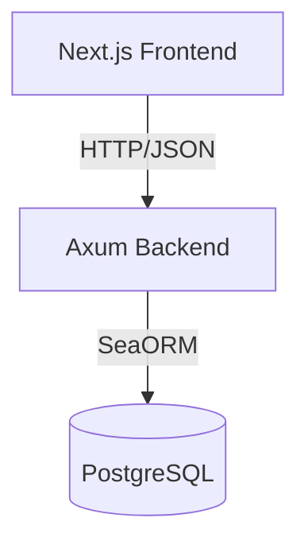
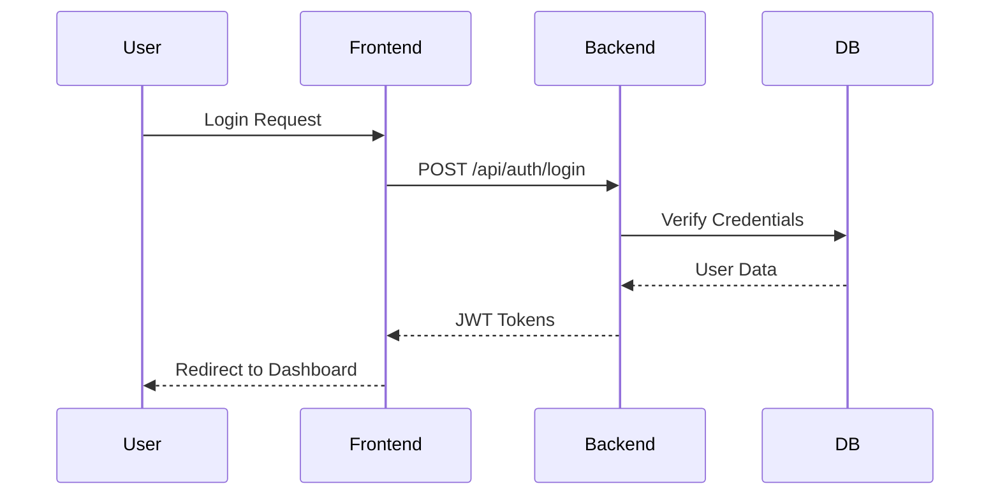
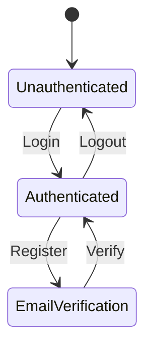

# Design: Improve Documentation

**Change ID**: improve-documentation
**Status**: Draft

## Overview

This design document outlines the approach for creating comprehensive, well-organized documentation for Cobalt Stack. The documentation will serve multiple personas (new developers, experienced contributors, DevOps teams) with focused, actionable content.

## Goals

1. **Discoverability**: Users can easily find information they need
2. **Clarity**: Documentation is clear, concise, and actionable
3. **Completeness**: All major features and workflows are documented
4. **Maintainability**: Documentation is easy to update and keep current
5. **Professionalism**: Matches industry standards for open-source projects

## Non-Goals

- Building a documentation website (static site generator) - keep as Markdown initially
- API reference generation from code comments (rely on Swagger/OpenAPI)
- Interactive tutorials or runnable notebooks
- Video tutorials or screencasts
- Multi-language translations

## Design Principles

### 1. **Progressive Disclosure**

Documentation is organized from simple to complex:
- Quick start → Installation → Guides → Architecture → Advanced Topics
- Each document assumes knowledge from previous level
- Cross-references allow jumping around for experienced users

### 2. **Task-Oriented**

Focus on user tasks rather than technical features:
- ❌ "SeaORM Configuration"
- ✅ "Managing Database Migrations"

### 3. **Show, Don't Tell**

Include code examples wherever possible:
- Runnable code snippets
- Complete examples for complex workflows
- Expected output shown

### 4. **Single Source of Truth**

Each concept documented in one canonical place:
- Other docs cross-reference rather than duplicate
- README.md links to detailed docs rather than duplicating

### 5. **Living Documentation**

Documentation evolves with the codebase:
- Docs review required in PR checklist
- Automated link checking
- Version documentation with releases

### 6. **Visual Communication**

Use diagrams and screenshots to enhance understanding:
- **Mermaid diagrams**: For architecture, flows, and system interactions
- **Screenshots**: For UI components, themes, and visual features
- **Code examples**: Always included with visual context where applicable

## Visual Documentation Standards

### Mermaid Diagrams

**When to Use**:
- Architecture overviews and system components
- Data flow and sequence diagrams
- State transitions and workflows
- API request/response flows
- Authentication and authorization flows

**Diagram Types**:
```markdown
<!-- System Architecture -->


<!-- Sequence Diagram -->


<!-- State Diagram -->

\```

**Best Practices**:
- Keep diagrams focused on one concept
- Use consistent naming across diagrams
- Include clear labels and arrows
- Test rendering in GitHub's Mermaid viewer
- Dark mode compatible colors

### Screenshots

**When to Use**:
- UI components and layouts
- Theme variations (light/dark modes)
- User flows and interactions
- Admin dashboard features
- Before/after comparisons

**Screenshot Guidelines**:
- **Resolution**: 1920x1080 or 2560x1440 for desktop, 375x667 for mobile
- **Format**: PNG for UI (lossless), JPEG for photos if needed
- **Optimization**: Compress with tools like pngquant or ImageOptim
- **File naming**: descriptive-kebab-case.png (e.g., `theme-cobalt-dark.png`)
- **Location**: `docs/frontend/screenshots/`
- **Annotations**: Use red boxes/arrows for important areas (optional)

**Required Screenshots**:
```
docs/frontend/screenshots/
├── themes/
│   ├── cobalt-light.png
│   ├── cobalt-dark.png
│   ├── nature-light.png
│   ├── nature-dark.png
│   ├── violet-bloom-light.png
│   └── violet-bloom-dark.png
├── components/
│   ├── button-variants.png
│   ├── form-elements.png
│   ├── card-components.png
│   └── navigation.png
├── features/
│   ├── authentication-flow.png
│   ├── admin-dashboard.png
│   └── user-profile.png
└── README.md  # Index of all screenshots
```

**Markdown Usage**:
```markdown
## Theme System

The Cobalt theme provides a professional blue color scheme:


*Figure 1: Cobalt theme in light mode*


*Figure 2: Cobalt theme in dark mode*
\```

## Documentation Structure Design

### Directory Organization

```
docs/
├── README.md                   # Navigation hub
├── getting-started/            # For new users
├── guides/                     # Feature-specific guides
├── architecture/               # Technical design docs
├── deployment/                 # Operations guides
├── api/                        # API reference
├── contributing/               # Contribution guidelines
└── troubleshooting/            # Problem-solving